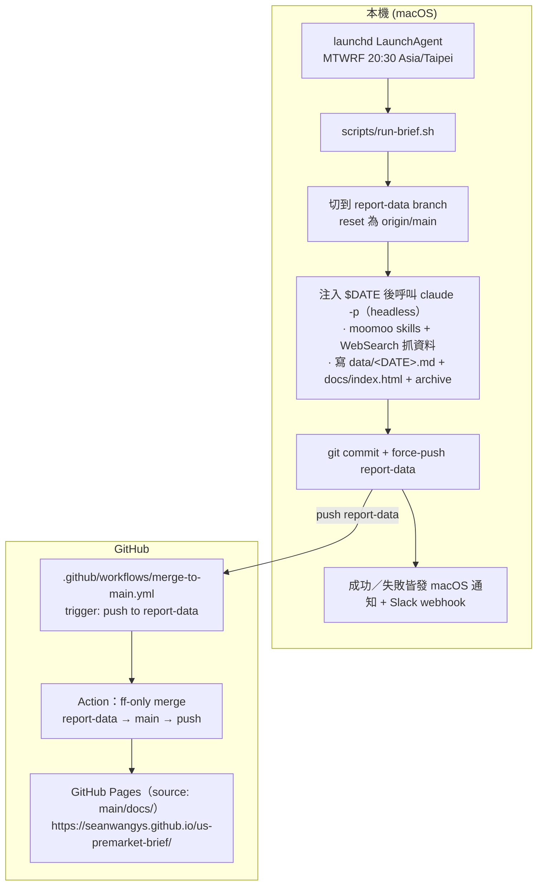

# US Premarket Brief

每個美股交易日 (週一至週五) 台北時間 20:30 自動產出一份繁體中文「美股盤前情報」報告，發佈到個人 GitHub Pages。

Live brief: **https://seanwangys.github.io/us-premarket-brief/**

---

## 專案目的

每日累積美股盤前情報、新聞解讀、市場情緒判讀的習慣，建立金融領域知識基礎。

追蹤標的採固定 watchlist（美股個股 / ETF + 台股 ETF）。**實際清單唯一定義在 `routine-prompt.md` 的「觀察清單」段**——本文件刻意不重複列出，避免 watchlist 調整時兩處不同步。

報告涵蓋：個股新聞 / 強訊號股 digest / 台股 ETF 新聞 / 情緒指標（AAII、VIX）/ AI 產業動態 / 宏觀經濟 / 政治地緣 / 每日財經名詞解析，產出格式為 markdown + HTML 雙版本。

---

## 架構總覽



**兩個 branch 的設計動機**：本機只 push `report-data`，main 由 GitHub Actions 自動 ff-merge。這樣本機腳本永遠不直接動 main，符合「Claude/local 不直接 push production branch」的安全規則。

---

## 使用技術

| 技術 | 用途 |
|---|---|
| **launchd** (macOS native) | 系統級排程，每週一至週五 20:30 觸發 |
| **Claude CLI** (`claude -p`) | Headless 模式跑 routine prompt；用 `--allowedTools` 限定 Skill / WebSearch / Write / Edit / Read / Bash |
| **moomoo skills** (search-only) | routine 使用 `moomoo-news-search`、`moomoo-stock-digest`；`moomoo-comment-sentiment` 已安裝但目前 routine 未呼叫。純查詢、無下單、無 OpenD 依賴。**注意：moomoo 無台股新聞覆蓋**，台股標的一律走 WebSearch（見 `routine-prompt.md` 步驟 3） |
| **WebSearch** (Claude built-in) | 抓台股 ETF 新聞、情緒指標 (AAII / VIX)、AI 產業、宏觀經濟與政治/地緣新聞 (Reuters / Bloomberg / CNBC / WSJ / 台灣財經媒體優先) |
| **GitHub Actions** | `merge-to-main.yml` 自動 ff-only 合併 report-data → main |
| **GitHub Pages** | 從 `main/docs/` serve 靜態 HTML |
| **Slack Incoming Webhook** | 成功 / 失敗通知 (本機讀 `~/.config/us-premarket-brief/slack_webhook`) |
| **Shell + curl** | `run-brief.sh` 處理 git ops、log、通知 |

---

## 本機環境需求

- macOS (測試於 Darwin 24.3.0)
- 可登入的 Claude 帳號 (Claude Code 訂閱)
- Git + GitHub SSH key 已設定 (推 `report-data` branch 用)
- Slack workspace + 一條 Incoming Webhook URL
- `curl`, `openssl`, `date` (macOS 內建)

---

## 移植到新 Mac 完整流程

> repo 放 **`~/us-premarket-brief`（Home 根目錄）**。`~/Documents`、`~/Desktop`、`~/Downloads` 受 macOS TCC 權限保護，launchd 子行程對這些資料夾沒有存取權；放在 Home 可避開這層。**不要把 repo 移進 `~/Documents/`，否則排程會壞。**
>
> 路徑示意一律用 `~` / `$HOME` / `<USER>`；請自行代換成你的家目錄。

### 1. 安裝 Claude CLI 並登入

```bash
curl -fsSL https://claude.ai/install.sh | bash   # 裝到 ~/.local/bin
claude                                            # 進互動視窗後輸入 /login 跑 OAuth
```

### 2. 安裝 3 個 moomoo skills（search-only）

```bash
mkdir -p ~/.claude/skills
# 放入 moomoo-news-search / moomoo-stock-digest / moomoo-comment-sentiment
# 來源：https://www.moomoo.com/skills/moomoo-install.md（或從舊 Mac scp）
ls ~/.claude/skills/        # 應見三個資料夾，各含 SKILL.md
```
> Skills 純 markdown、只連 `ai-news-search.moomoo.com`、無認證 / Cookie。

### 3. Clone repo

```bash
cd ~ && git clone git@github.com:SeanWangYS/us-premarket-brief.git
```
> `routine-prompt.md` 已 track 在 git 內，clone 後即在。要本機改 prompt 又不想 commit，用 `git stash`，**別**把它加進 `.gitignore`。

### 4. Slack webhook（選用；沒設只是不發通知）

```bash
mkdir -p ~/.config/us-premarket-brief
echo '<你的 Slack webhook URL>' > ~/.config/us-premarket-brief/slack_webhook
chmod 600 ~/.config/us-premarket-brief/slack_webhook
```
> 沒有 webhook：api.slack.com/apps → 建 app → Incoming Webhooks → On → 複製 URL。

### 5. 安裝 launchd plist

```bash
cp ~/us-premarket-brief/launchd/com.seanwang.us-premarket-brief.plist ~/Library/LaunchAgents/
plutil -lint ~/Library/LaunchAgents/com.seanwang.us-premarket-brief.plist   # 應回 OK
```
> - **使用者名稱不同時**：把 plist 內所有 `/Users/<舊名>/…` 換成 `/Users/<新名>/…`（plist 不吃 `$HOME` 變數）。`run-brief.sh` 用 `$HOME`，不用改。
> - launchd 只讀 `~/Library/LaunchAgents/` 那份，repo 內的是備份；改完 live 版要 `cp` 回 repo commit，下台 Mac 才同步得到。

### 6. 手動跑一次驗證（從 Terminal）

```bash
bash ~/us-premarket-brief/scripts/run-brief.sh   # 約 8–10 分鐘，全程 buffer
```
成功 = macOS / Slack 通知 + log 結尾 `=== run-brief.sh done OK ===` + Pages 1–3 分鐘內更新。失敗先看 log，再看 GitHub Actions。

> Terminal 手動跑有完整權限，所以這步會過；但排程是 launchd 在**背景**跑，少了「醒著」與「檔案權限」兩件事 → 下一步補上。

### 7. 兩個系統層設定（關鍵；不在 git 內，換 Mac / macOS 大版本升級要重做）

**(a) 預先喚醒** — launchd 不會叫醒睡著的 Mac（否則 20:30 在睡就拖到醒來才補跑）：

```bash
bash ~/us-premarket-brief/scripts/setup-wake-schedule.sh   # sudo pmset repeat wake MTWRF 20:28
pmset -g sched      # 確認出現 "Repeating power events"
```

**(b) 給 `claude` 完整磁碟取用權限（FDA）** — 否則排程會卡在權限彈窗：

`claude -p` 啟動時會讀全域設定 `~/.claude.json`，裡面可能登記了放在 `~/Documents`（受 TCC 保護）的其他 Claude Code 專案；launchd 背景情境沒這權限 → 跳「想取用『文件』資料夾」彈窗、**卡住整個 run**，而對 launchd 程式按「允許」不會持久（macOS 已知限制）。治本是把 claude 執行檔加進 FDA：

```bash
readlink -f ~/.local/bin/claude    # 印出真正的執行檔路徑（含版本號）
```
系統設定 → 隱私權與安全性 → **完整磁碟取用權限** → 按 ＋ → 檔案視窗按 ⌘⇧G 貼上上面那條路徑 → 開啟 → 打開開關。

> `~/.local/bin/claude` 是 symlink，FDA 不能加 symlink，要加它指向的「真正執行檔」（即 `readlink -f` 的輸出）。claude 自動更新換版本後若彈窗重現，用同指令找新路徑重加一次。

### 8. 啟用排程

```bash
launchctl load ~/Library/LaunchAgents/com.seanwang.us-premarket-brief.plist
launchctl list | grep premarket    # 應見 com.seanwang.us-premarket-brief
```
下一個 MTWRF 20:30 自動觸發。

### 9. GitHub 設定（只在 fork 新 repo 時做一次）

- **Settings → Actions → General → Workflow permissions**：`Read and write permissions`（讓 ff-merge workflow 能 push main）
- **Settings → Pages → Source**：`Deploy from a branch` + `main` + `/docs`
- **`report-data` branch**：從 main 開，或本機第一次 push 時自動建立

---

## 維運速查

| 動作 | 指令 |
|---|---|
| 啟用排程 | `launchctl load ~/Library/LaunchAgents/com.seanwang.us-premarket-brief.plist` |
| 停用排程 (保留檔案) | `launchctl unload ~/Library/LaunchAgents/com.seanwang.us-premarket-brief.plist` |
| 確認排程已載入 | `launchctl list \| grep premarket` |
| 手動觸發 | `bash ~/us-premarket-brief/scripts/run-brief.sh` |
| 看執行 log | `tail -100 ~/Library/Logs/us-premarket-brief.log` |
| 看 launchd 自身 log | `tail -50 ~/Library/Logs/us-premarket-brief.launchd.log` |
| 改 prompt | 編 `~/us-premarket-brief/routine-prompt.md`；commit + push 到 main 後其他 Mac `git pull` 即同步 |
| 改觸發時間 | 編 plist 的 `StartCalendarInterval` 後 `launchctl unload && launchctl load`；**同時**改 `scripts/setup-wake-schedule.sh` 的 `WAKE_TIME` 並重跑它，否則喚醒時間會對不上 |
| 設定 / 更新預先喚醒 | `bash ~/us-premarket-brief/scripts/setup-wake-schedule.sh` (需 sudo) |
| 查看喚醒排程 | `pmset -g sched` (看 "Repeating power events") |
| 取消喚醒排程 | `sudo pmset repeat cancel` |
| Slack webhook 換新 | 重寫 `~/.config/us-premarket-brief/slack_webhook` (mode 600) |

---

## 故障排除 (常見問題)

### 1. claude -p 看起來「卡住」沒 output

正常現象。`claude -p` 全程 buffer，要跑完才會把整段 dump 出來。**不要 kill**，預估 8–10 分鐘。看 `~/Library/Logs/us-premarket-brief.log` 確認最後一行是不是 `starting claude -p ...`。

### 2. 報告底部「Skills loaded」三個全部 ❌

權限沒對。檢查 `scripts/run-brief.sh` 內有沒有：
```bash
--allowedTools "Skill WebSearch Write Edit Read Bash"
```

只用 `--permission-mode acceptEdits` **不夠**，Skill / WebSearch 會被 silent deny。

### 3. GitHub Actions ff-merge 失敗

理論上不該發生 (因為 `run-brief.sh` 每次都 `git reset --hard origin/main` 保證 report-data 永遠領先 main 至少 1 commit)。若發生：到 Actions tab 看錯誤 → 通常是 `report-data` 與 `main` 歷史分叉了 → 解法是把 `report-data` 砍掉重建。

### 4. launchd 觸發時找不到 `claude`

plist 內 `EnvironmentVariables.PATH` 沒包含 `~/.local/bin`。檢查並補上 (用絕對路徑：`/Users/<NEW_USER>/.local/bin`)。

### 5. 排程觸發但 laptop 睡眠 / 閒置 → 跑很晚或跑到一半凍結

launchd `StartCalendarInterval` **不會**喚醒睡眠中的 Mac：若 20:30 時筆電在睡（或閒置即將睡），job 只會等 Mac 下次醒來才補跑（log 看過 20:30 的 job 拖到 23:23、甚至隔天早上才完成）。更糟的是若跑到一半 Mac 睡著，整個行程會被**凍結數小時**。

本專案已用兩層機制處理（合稱「方向 B」）：

1. **跑到一半不被凍結** — `run-brief.sh` 開頭用 `caffeinate -ims` 重啟自己一次，整段 git + claude + push 期間持有電源 assertion，阻止系統閒置睡眠。**注意**：caffeinate 擋不住「闔上蓋」的 clamshell 睡眠。
2. **保證 20:30 是醒的** — `scripts/setup-wake-schedule.sh` 用 `pmset repeat wakeorpoweron MTWRF 20:28:00` 在觸發前 2 分鐘喚醒 Mac。這是系統層設定（需 sudo、不存在 git 內），**換新 Mac 或 macOS 大版本升級後要重跑一次**。

驗證喚醒排程是否還在：`pmset -g sched`（看 "Repeating power events"）。取消：`sudo pmset repeat cancel`。

> 若 20:30 時你常**闔上筆電蓋**（而非開蓋閒置），caffeinate 無法阻止 clamshell 睡眠 → 要嘛保持開蓋、要嘛改用 `caffeinate -s` 並接電源、要嘛把整套搬到常開機器（雲端 / Mac mini / GitHub Actions）。

### 6. 報告日期跨夜對不上

`run-brief.sh` 已注入 `$DATE` 到 prompt header，Claude 應該用 shell 的日期。若 prompt 被改、移除了「請使用此日期，不要自行計算」段，可能會跨夜不同步。

---

## 檔案地圖

### 在 repo 內 (git 追蹤)

| 路徑 | 用途 |
|---|---|
| `routine-prompt.md` | 給 Claude 讀的 routine 指令 |
| `scripts/run-brief.sh` | launchd 入口；shell wrapper 處理 git ops + 通知；開頭用 caffeinate 重啟自己以防跑到一半睡眠凍結 |
| `scripts/setup-wake-schedule.sh` | 一次性設定 `pmset` 預先喚醒（20:28）讓排程準時觸發；需 sudo，換 Mac / 升級後重跑 |
| `launchd/com.seanwang.us-premarket-brief.plist` | launchd 排程 plist 的 snapshot；新 Mac 從這裡 cp 到 `~/Library/LaunchAgents/`。**不會自動同步**：改完 live plist 後手動 cp 回來再 commit |
| `.github/workflows/merge-to-main.yml` | GH Actions ff-merge report-data → main |
| `data/<YYYY-MM-DD>.md` | 每日 markdown 原稿 (自動產生) |
| `data/glossary-index.md` | 「今日名詞解析」累積索引（`日期 \| 詞彙` 一行一筆，routine 自動 append，做 20 天內選詞去重） |
| `docs/index.html` | 最新報告 (每日覆蓋) |
| `docs/archive/<YYYY-MM-DD>.html` | 每日存檔 |
| `README.md` | 本文件 |

### 系統層 (不在 repo 內)

| 路徑 | 用途 |
|---|---|
| `~/Library/LaunchAgents/com.seanwang.us-premarket-brief.plist` | 真正被 launchd 讀的 plist（從 repo 的 `launchd/` 拷過來） |
| `pmset repeat` 喚醒排程（系統狀態，非檔案） | 由 `scripts/setup-wake-schedule.sh` 設定的每日 20:28 喚醒；`pmset -g sched` 可查、`sudo pmset repeat cancel` 可清 |
| `claude` 完整磁碟取用權限 / FDA（系統設定，非檔案） | `claude` 執行檔加進 系統設定 → 隱私權與安全性 → 完整磁碟取用權限；否則 launchd 背景跑的 `claude -p` 會被「取用 Documents」彈窗卡住整個 run。claude 更新換版本後可能要重加（見移植流程 Step 7b） |
| `~/Library/Logs/us-premarket-brief.log` | run-brief.sh + claude 整合 log |
| `~/Library/Logs/us-premarket-brief.launchd.log` | launchd 自身 stdout/stderr |
| `~/.config/us-premarket-brief/slack_webhook` | Slack Incoming Webhook URL (mode 600) |
| `~/.claude/skills/moomoo-news-search/` | moomoo 個股新聞 skill |
| `~/.claude/skills/moomoo-stock-digest/` | moomoo 個股 digest skill |
| `~/.claude/skills/moomoo-comment-sentiment/` | moomoo 散戶情緒 skill |

---

## 安全 / 合規備註

- **Skills 範圍**：只用 search-only skills，未安裝 OpenD / 下單 / anomaly 類 skill
- **本機 push 限制**：`run-brief.sh` 內的 `git push -f` 只動 `report-data` branch，不直接動 `main`
- **GH Actions 寫 main**：由使用者在 repo Settings 明確授權設定的 workflow 完成，不是由 Claude 即時動手
- **Slack URL 是 credential**：存放在 `~/.config/us-premarket-brief/slack_webhook`，mode 600，**不**進 git
- **報告免責聲明**：每份 brief 底部有「本報告僅整理公開資訊，不構成任何投資建議」
